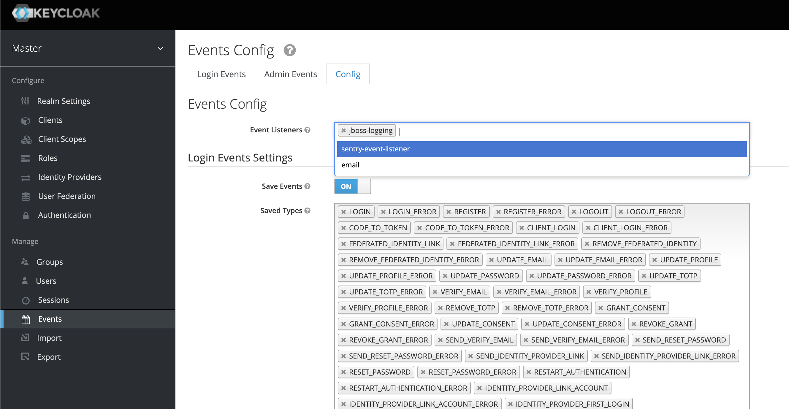

# Keycloak Sentry Logger

A Keycloak Event Listener that logs errors or all events to Sentry.

## Installation

Use the latest prebuilt `jar` file from the releases tab on GitHub or build the package yourself using `mvn clean package`. In your Dockerfile add `COPY ./dev.yakovlev_alexey-keycloak-sentry-logger-*.jar /opt/keycloak/providers/`.

## Configuration

First you need to set required environment variables for this plugin. At the moment of writing Keycloak would not allow custom event listeners to be configured. So the only source of configuration is the environment.

Following environment variables _must_ be set:

```
SENTRY_DSN=<your Sentry DSN>
SENTRY_ERRORS_ONLY=true
```

> `SENTRY_ERRORS_ONLY` may not be set however I strongly recommend to only log errors since Keycloak produces a lot of generic events you will likely have no use for. Set to false only when you know you are going to need generic events in your sentry logs.

Following environment variables _can_ be set:

```
SENTRY_RELEASE=<release to be sent in events>
SENTRY_DEBUG=<run Sentry SDK in debug mode>
SENTRY_IGNORED_EVENT_TYPES=<';' separated list of event types (commonly upper snakecase) to be ignored>
SENTRY_IGNORED_ERRORS=<';' separated list of error message (commonly lower snakecase) to be ignored>
```

An example configuration might look like this:

```bash
SENTRY_DSN=https://1662634ef57g32228a3fe14cf541987e@o3210317.ingest.sentry.io/6413214 # make sure to use your own DSN
SENTRY_ERRORS_ONLY=true
SENTRY_RELEASE=31187a77ec1
SENTRY_IGNORED_ERRORS=invalid_user_credentials;expired_code
```

After you launch your Keycloak instance with included `jar` file and updated environment variables make sure to enable `sentry-event-listener` in your realm. To do this enter `Manage > Events > Config > Events Config > Event Listeners` and select `sentry-event-listener` from the dropdown menu.



> Note, that it is not a requirement to enable `Save Events` option lower on the configuration page. It only affects past events visibility in Keycloak `Login Events` and `Admin Events` tabs on the same page.

## Usage

When events are sent to Sentry they usually include a Stack Trace with the origin of the event. The event in Sentry will also have Additional Data populated with information that came with the event. This may include `realmId`, `clientId`, `username` and other data specific to particular events.

Events are usually tied to a specific user. In Sentry an id will be shown - this is the id of this user in Keycloak.

If the plugin is used to send all events (not just errors) then event type will be used as the name for the event. This is due to the fact that only error events have a message. However when error only mode is on, the error message will be used as the name for Sentry event. In any configuration event types are stored in tag name `type`.

Admin and login events can be distinguished by the `source` tag. It will be `admin` for admin events and `common` for login events.

## Roadmap

This plugin is being used in a relatively large production. I will continue to improve it if I see places of improvement. At the moment I am looking into making this plugin log certain exceptions from Keycloak.

## Contributing

Anyone is welcome to open issues with enhancement proposals and questions. If you have a specific implementation in mind the project is open to Pull Requests.

## License

[MIT](/LICENSE)
